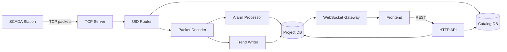
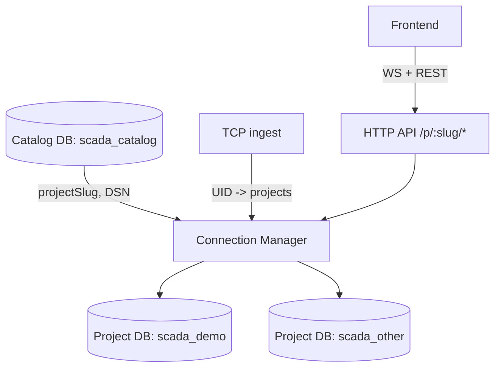
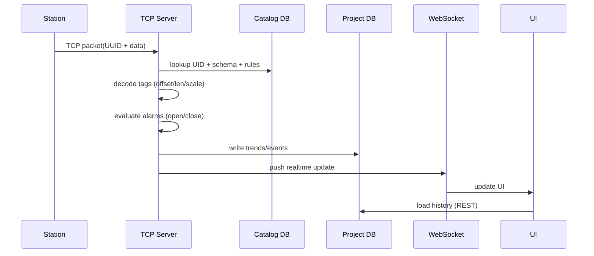

## Диаграммы (Mermaid)

### 1) Компоненты и связи

```mermaid
flowchart LR
  Station[SCADA Station] -->|TCP packets| TCP[TCP Server]
  TCP --> Router[UID Router]
  Router --> Decoder[Packet Decoder]
  Decoder --> Alarm[Alarm Processor]
  Alarm --> PDB[(Project DB)]
  Decoder --> Trends[Trend Writer] --> PDB
  Router --> CDB[(Catalog DB)]
  PDB --> WS[WebSocket Gateway] --> UI[Frontend]
  UI -->|REST| API[HTTP API]
  API --> CDB
  API --> PDB
```

### 2) Мультитенантность (каталог + проектные БД)

```mermaid
flowchart TB
  CDB[(Catalog DB: scada_catalog)] -->|projectSlug, DSN| CM[Connection Manager]
  CM --> P1[(Project DB: scada_demo)]
  CM --> P2[(Project DB: scada_other)]
  TCP[TCP ingest] -->|UID -> projects| CM
  API[HTTP API /p/:slug/*] --> CM
  UI[Frontend] -->|WS + REST| API
```

### 3) Поток данных (пакет → событие → UI)

```mermaid
sequenceDiagram
  participant S as Station
  participant T as TCP Server
  participant C as Catalog DB
  participant P as Project DB
  participant W as WebSocket
  participant U as UI
  S->>T: TCP packet(UUID + data)
  T->>C: lookup UID + schema + rules
  T->>T: decode tags (offset/len/scale)
  T->>T: evaluate alarms (open/close)
  T->>P: write trends/events
  T->>W: push realtime update
  W->>U: update UI
  U->>P: load history (REST)
```

